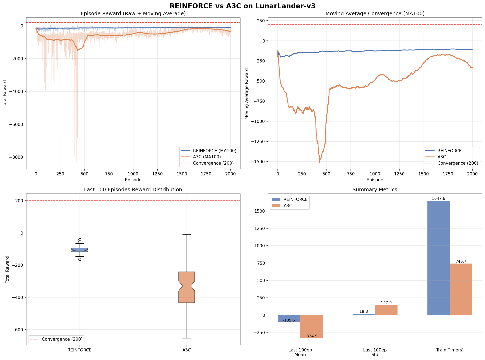

# REINFORCE vs A3C on LunarLander-v3

PyTorch 기반으로 **REINFORCE + Baseline**과 **A3C(Asynchronous Advantage Actor-Critic)** 를 직접 구현하고 비교 실험한 프로젝트입니다.

<details>
<summary><h2>👓 Vanilla REINFORCE가 아닌 REINFORCE + Baseline와 비교한 이유! </h2></summary>

### 1. 실험 목적
"이 실험의 목적은 알고리즘의 학습 메커니즘 차이가 성능에 미치는 영향을 보는 것이었습니다."

### 2. 변수 통제 관점
  - Vanilla REINFORCE와 A3C를 비교하면 차이점이 너무 많아져요.
    - 네트워크 구조 (Actor only vs ActorCritic)
    - return 계산 방식 (Monte Carlo vs n-step)
    - 병렬성 (단일 vs 4 Worker)

이 중 어떤 요소가 성능 차이를 만들었는지 구분이 안 됩니다.

### 3. 통제한 변수
REINFORCE + Baseline을 쓰면 네트워크 구조를 ActorCritic으로 통일할 수 있어요.
그러면 남는 차이는

- episode 단위 vs n-step 업데이트
- 단일 에이전트 vs 비동기 병렬
  
이 두 가지만 남아서 A3C의 핵심 기여를 분리해 볼 수 있습니다.

</details>

---

## 목차
1. 프로젝트 개요
2. 알고리즘 설명
3. 실험 설계
4. 네트워크 구조
5. 실험 결과
6. 환경 설정
7. 실행 방법
8. 노트북 구조
9. 한계점 및 고찰

---

## 1️⃣ 프로젝트 개요

강화학습 알고리즘의 발전 흐름 중 **Policy Gradient 계열** 두 알고리즘을 직접 구현하고, 동일한 환경에서 성능을 비교합니다.

| 항목 | 내용 |
|------|------|
| 환경 | LunarLander-v3 (gymnasium) |
| 비교 알고리즘 | REINFORCE + Baseline vs A3C |
| 프레임워크 | PyTorch |
| 실행 환경 | Local Jupyter (GPU 지원) |

---

## 2️⃣ 알고리즘 설명

### REINFORCE + Baseline

Vanilla REINFORCE에 Critic을 baseline으로 추가한 버전입니다.

**업데이트 수식:**
```
G_t        = Σ γ^k * r_{t+k}        (Monte Carlo return)
Advantage  = G_t - V(s_t)            (baseline으로 분산 감소)

Actor loss  = -log π(a|s) * Advantage
Critic loss = MSE(V(s), G_t)
Total loss  = actor_loss + critic_loss
```

**특징:**
- Episode가 끝난 뒤 한 번에 업데이트
- Monte Carlo return으로 분산이 큰 편
- 단일 에이전트

---

### A3C (Asynchronous Advantage Actor-Critic)

DeepMind 2016 논문([Mnih et al.](https://arxiv.org/abs/1602.01783)) 기반 구현입니다.

**업데이트 수식:**
```
G_t = r_t + γ*r_{t+1} + ... + γ^{n-1}*r_{t+n-1} + γ^n * V(s_{t+n})
                                                    └── Bootstrap
Advantage  = G_t - V(s_t)

Actor loss  = -log π(a|s) * Advantage
Critic loss = MSE(V(s), G_t)
Entropy     = -Σ π(a|s) * log π(a|s)
Total loss  = actor_loss + critic_loss - β * entropy
```

**특징:**
- T_MAX(5) 스텝마다 중간 업데이트 (Bootstrap)
- Worker 4개가 비동기 병렬 수집
- Entropy Bonus로 탐색 촉진
- Local gradient → Global network에 비동기 적용

---

## 3️⃣ 실험 설계

두 알고리즘의 차이를 공정하게 비교하기 위해 아래 조건을 통일했습니다.

| 항목 | 설정 |
|------|------|
| 네트워크 구조 | 동일한 ActorCritic (공유 Backbone) |
| 총 에피소드 | 2,000 |
| 할인율 γ | 0.99 |
| 학습률 | 1e-4 (Adam) |
| Seed | 42 |

**비교 지표:**
- 수렴 속도 — 이동평균(100ep) 200점 달성까지 걸린 에피소드 수
- 안정성 — 최종 100ep 리워드 표준편차
- 최종 성능 — 최종 100ep 평균 리워드
- 학습 시간 — Wall-clock time

---

## 4️⃣ 네트워크 구조

REINFORCE와 A3C 모두 동일한 ActorCritic 네트워크를 사용합니다.

```
Input (8)
  │
[Shared Backbone]
Linear(8 → 256) → ReLU
Linear(256 → 128) → ReLU
  │
  ├──────────────────┐
[Actor Head]    [Critic Head]
Linear(128→4)   Linear(128→1)
Softmax              │
π(a|s)            V(s)
```

| 항목 | 값 |
|------|-----|
| 입력 차원 | 8 (LunarLander 상태 공간) |
| 출력 (Actor) | 4 (이산 행동 공간) |
| 출력 (Critic) | 1 (스칼라 가치) |
| 총 파라미터 수 | ~100K |
| 가중치 초기화 | Orthogonal |

---

## 5️⃣ 실험 결과

### 수치 요약


### 결과 시각화

A3C는 본래 multiprocessing 기반으로 설계된 알고리즘인데, Python GIL 제약으로 threading을 사용하면 비동기 병렬의 이점을 살리지 못했습니다. 그 결과 gradient 간섭으로 인한 학습 불안정이 발생하고, 단일 에이전트인 REINFORCE보다 성능이 낮게 나타났습니다. 실전에서는 multiprocessing 전환이나 PPO 같은 배치 기반 알고리즘이 권장되는 이유입니다.!



---

## 6️⃣ 환경 설정

```bash
pip install gymnasium[box2d] torch numpy matplotlib
```

| 패키지 | 버전 |
|--------|------|
| Python | 3.10+ |
| PyTorch | 2.0+ |
| gymnasium | 1.0+ |
| numpy | 1.24+ |
| matplotlib | 3.7+ |

---

## 7️⃣ 실행 방법

```bash
git clone https://github.com/KDT-final-project-team4/RL_A3C_Implement.git
cd RL_A3C_Implement
jupyter notebook reinforce_vs_a3c.ipynb
```

셀을 순서대로 실행하세요:
1. 셀 1: 환경 설정
2. 셀 2: 네트워크 정의
3. 셀 3: REINFORCE 정의
4. 셀 4: A3C 정의
5. 셀 5: 학습 실행 ← 시간이 걸립니다
6. 셀 6: 결과 시각화

---

## 8️⃣ 노트북 구조

```
reinforce_vs_a3c.ipynb
├── 셀 1: 설치 및 환경 설정
│         gymnasium[box2d], 하이퍼파라미터, 시드 고정
├── 셀 2: 공통 ActorCritic 네트워크
│         Backbone + Actor/Critic head 분리
├── 셀 3: REINFORCE + Baseline
│         Monte Carlo return, episode 단위 업데이트
├── 셀 4: A3C
│         Worker(threading), n-step Bootstrap, 비동기 업데이트
├── 셀 5: 학습 실행
│         동일 조건 순차 실행, results 딕셔너리 저장
└── 셀 6: 비교 시각화
          Raw/MA 곡선, Boxplot, 지표 요약 Bar chart
```

---
